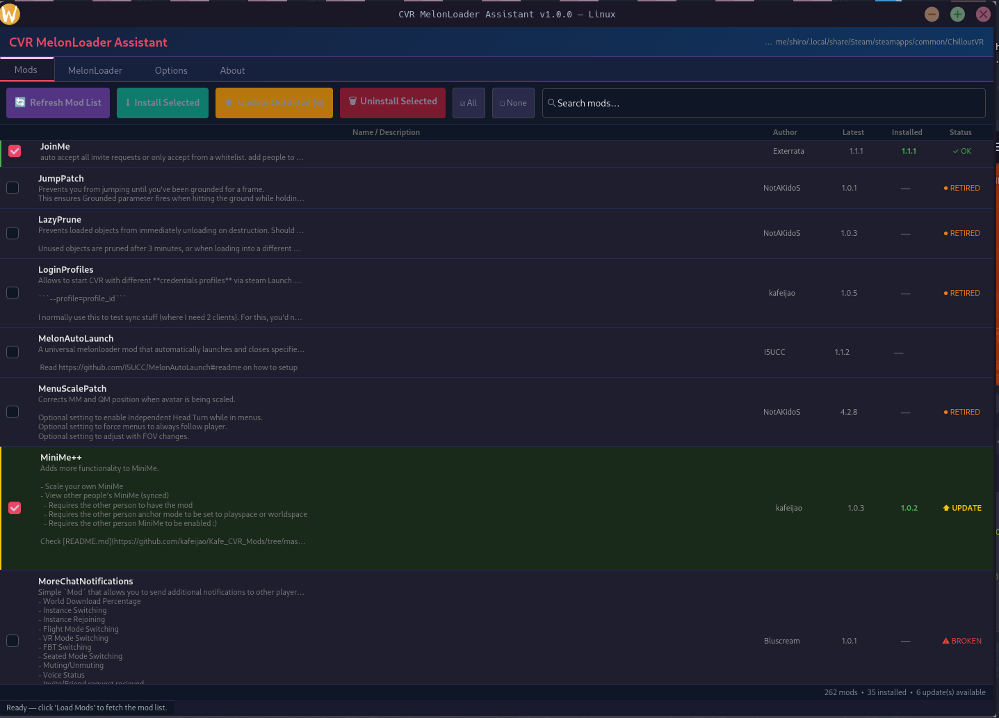

> [!NOTE]
> This project is **vibe coded** using [Claude](https://claude.ai) by Anthropic.
> It may contain bugs or behave unexpectedly. Use at your own risk, and please report issues on GitHub.

# CVR MelonLoader Assistant — Linux Port

A Linux port of [CVRMelonAssistant](https://github.com/Nirv-git/CVRMelonAssistant) by Nirv-git & knah, rewritten in Rust with a GTK4 GUI.

Ported and maintained by **[Kneesox](https://kneesox.moe)**.



## Features

- 🔍 Auto-detects ChilloutVR via Steam on Linux (`~/.local/share/Steam`, Steam Deck, Flatpak)
- 📦 Browse, install, and uninstall mods from the CVRMG mod repository
- ⬆️ Detect and update outdated mods using version data read directly from each mod's DLL
- ⬇️ Install / update / remove MelonLoader
- 🚫 Automatically moves mods marked **broken** to `Mods/Broken/` and **retired** to `Mods/Retired/` on update
- 👤 Detects user-installed mods not listed in CVRMG and shows them separately — they are never auto-updated
- 🔎 Search and filter mods by name or description
- 🎨 Dark-themed GTK4 GUI

## Building

### Requirements

- **Rust 1.85+** (`rustup` recommended)
- **GTK4 dev libraries**
- **OpenSSL dev libraries**

### Ubuntu / Debian / Steam Deck

```bash
sudo apt install libgtk-4-dev pkg-config libssl-dev build-essential
curl --proto '=https' --tlsv1.2 -sSf https://sh.rustup.rs | sh
source $HOME/.cargo/env
cargo build --release
```

### Fedora / RHEL

```bash
sudo dnf install gtk4-devel pkgconf openssl-devel
curl --proto '=https' --tlsv1.2 -sSf https://sh.rustup.rs | sh
source $HOME/.cargo/env
cargo build --release
```

### Arch Linux

```bash
sudo pacman -S gtk4 pkgconf openssl base-devel
curl --proto '=https' --tlsv1.2 -sSf https://sh.rustup.rs | sh
source $HOME/.cargo/env
cargo build --release
```

The binary will be at `target/release/cvr-melon-assistant`.

## MelonLoader + Proton

ChilloutVR is a **Windows-only** game running via **Steam Play (Proton)** on Linux. Add this to ChilloutVR's Steam launch options to enable MelonLoader:

```
WINEDLLOVERRIDES="version=n,b" %command%
```

## Credits

- Original Windows app by [Nirv-git & knah](https://github.com/Nirv-git/CVRMelonAssistant)
- Linux port by [Kneesox](https://kneesox.moe)
- Vibe coded with [Claude](https://claude.ai) by Anthropic
- Mod repository: [CVRMG](https://api.cvrmg.com/v1/mods)
- [MelonLoader](https://melonwiki.xyz) by LavaGang

## Project Structure

| File | Description |
|------|-------------|
| `src/main.rs` | Entry point, Tokio runtime setup, `spawn_async` helper |
| `src/models.rs` | Data structs (`Mod`, `ModVersion`, etc.) |
| `src/api.rs` | HTTP client, CVRMG API, version comparison |
| `src/steam.rs` | Steam install detection (Linux paths) |
| `src/install.rs` | MelonLoader + mod install/uninstall/quarantine |
| `src/melon_dll.rs` | PE/CLI metadata parser — reads `MelonInfoAttribute` from mod DLLs |
| `src/config.rs` | Persistent config at `~/.config/CVRMelonAssistant/` |
| `src/ui.rs` | GTK4 GUI — mods list, options, MelonLoader tab, dark theme |
