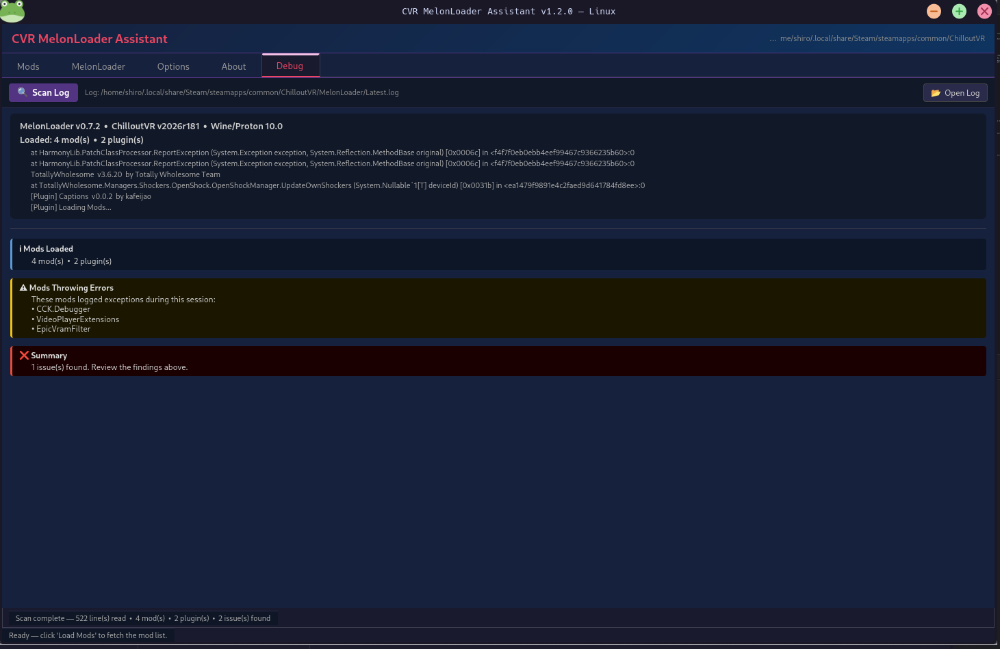

> [!NOTE]
> This project contains **AI Assisted** code using [Claude](https://claude.ai) by Anthropic.
> It may contain bugs or behave unexpectedly. Use at your own risk, and please report issues on GitHub.

# CVR MelonLoader Assistant — Linux Port

A Linux port of [CVRMelonAssistant](https://github.com/Nirv-git/CVRMelonAssistant) by Nirv-git & knah, rewritten in Rust with a GTK4 GUI.

Ported and maintained by **[Kneesox](https://kneesox.moe)**.




---

## Features

- Auto-detects ChilloutVR via Steam on Linux (`~/.local/share/Steam`, Steam Deck, Flatpak and many more)
- Parse melonloader logs and breakdown issues, ported from lumbot in the cvrmg discord
- Browse, install, and uninstall mods from the CVRMG mod repository
- Detect and update outdated mods using version data read directly from each mod's DLL
- Install / update / remove MelonLoader
- Automatically moves mods marked **broken** to `Mods/~Broken/` and **retired** to `Mods/~Retired/` on update
- Detects user-installed mods not listed in CVRMG and shows them separately — they are never auto-updated
- Search and filter mods by name or description
- Dark-themed GTK4 GUI

---

## Installation

### Arch Linux, Manjaro, EndeavourOS, Steam Deck, and other Arch-based distros

Install from the AUR — the package always tracks the latest commit, so no manual version updates are needed:

```bash
paru -S cvr-melon-assistant-git
# or
yay -S cvr-melon-assistant-git
```

### AppImage — any distro

Pre-built AppImages are available on the [Releases page](https://github.com/ShiroBlank/CVRMelonAssistantLinux/releases):

```bash
chmod +x CVRMelonAssistant-x86_64.AppImage
./CVRMelonAssistant-x86_64.AppImage
```

### Build from source

**Requirements:** Rust 1.85+, GTK4 dev libraries, OpenSSL dev libraries.

<details>
<summary>Ubuntu / Debian</summary>

```bash
sudo apt install libgtk-4-dev pkg-config libssl-dev build-essential
curl --proto '=https' --tlsv1.2 -sSf https://sh.rustup.rs | sh
source $HOME/.cargo/env
cargo build --release
```
</details>

<details>
<summary>Fedora / RHEL</summary>

```bash
sudo dnf install gtk4-devel pkgconf openssl-devel
curl --proto '=https' --tlsv1.2 -sSf https://sh.rustup.rs | sh
source $HOME/.cargo/env
cargo build --release
```
</details>

<details>
<summary>Arch Linux (manual build)</summary>

```bash
sudo pacman -S gtk4 pkgconf openssl base-devel
curl --proto '=https' --tlsv1.2 -sSf https://sh.rustup.rs | sh
source $HOME/.cargo/env
cargo build --release
```
</details>

The binary will be at `target/release/cvr-melon-assistant`.

---

## MelonLoader + Proton

ChilloutVR is a **Windows-only** game running via **Steam Play (Proton)** on Linux. Add this to ChilloutVR's Steam launch options to enable MelonLoader:

```
WINEDLLOVERRIDES="version=n,b" %command%
```

---

## Credits

| | |
|---|---|
| Original Windows app | [Nirv-git & knah](https://github.com/Nirv-git/CVRMelonAssistant) |
| Linux port | [Kneesox](https://kneesox.moe) |
| AI assisted via | [Claude](https://claude.ai) by Anthropic |
| Log scanner ported from | [Lumbot](https://github.com/Slaynash/Lumbot) by Slaynash |
| Mod repository | [CVRMG](https://api.cvrmg.com/v1/mods) |
| Mod loader | [MelonLoader](https://melonwiki.xyz) by LavaGang |
